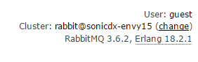
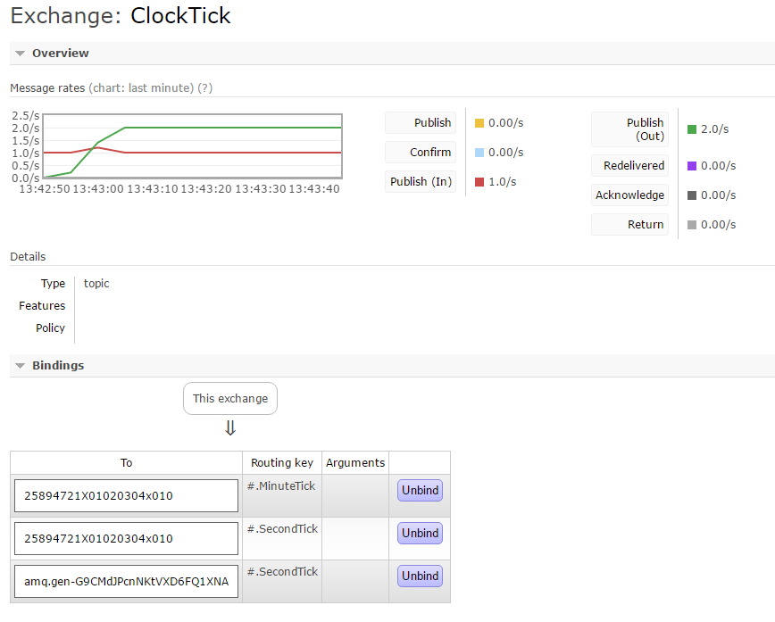
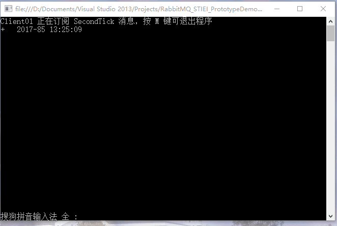
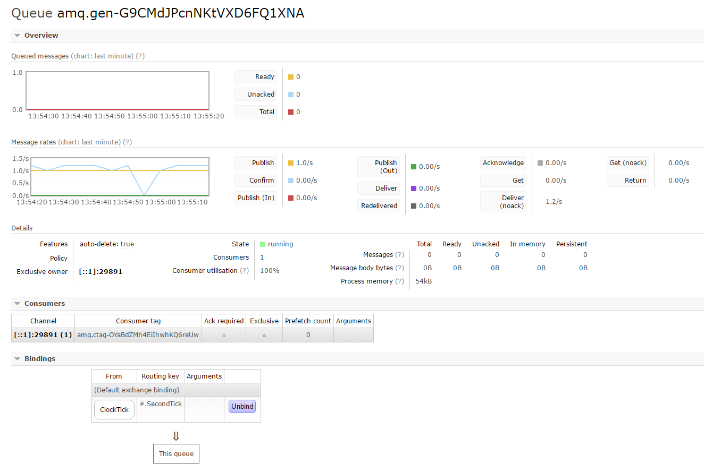
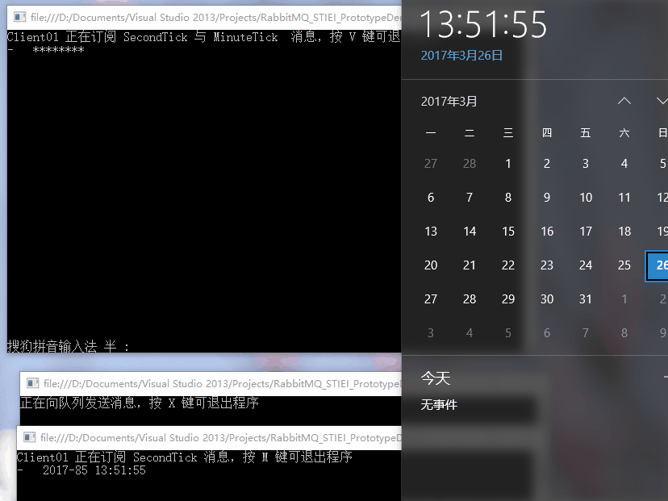
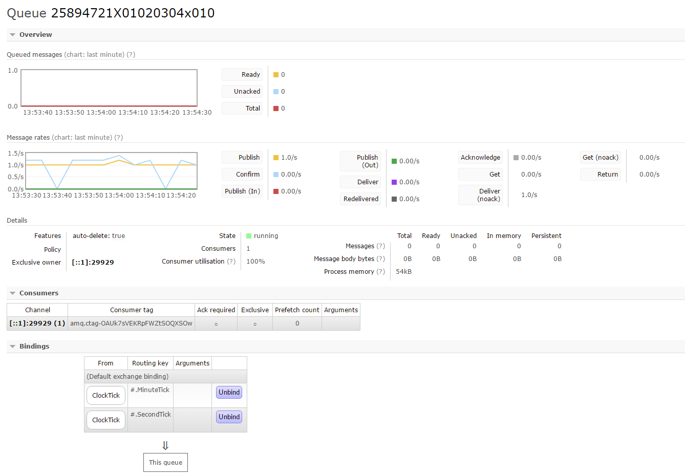

上海电子信息职业技术学院 消息总线原型演示 
===========================================================
[TOC]
## 项目说明

​	**AppBase_Send** 模拟一个应用，产生一个消息源。应用名 `ClockTick` , 其消息交换机名称同应用名。 应用编号0x01020304。

​	**Client01** 模拟一个应用，订阅**AppBase_Send** 发布的 *SecondTick* 消息。

​	**Client02** 模拟一个应用，同时订阅 *SecondTick* 与 *MinuteTick* 消息。

> **运行环境**
>
> 客户端： .Net Framework 4.5.1
>
> ​	客户端依赖： RabbitMQ.Client  4.1.1 | Newtonsoft.Json 9.0.1 | Quartz 2.5
>
> 服务端：  RabbitMQ  3.6.2 | Erlang 18.2.1  所有服务按默认设置运行
>
> 


## 技术架构

​	**AppBase_Send** 建立了一个名为`ClockTick` ，类型为 “Topic" 的交换机，主体功能代码在 `Program.cs`。

​		该应用模拟一个应用，产生一个消息源。应用名 `ClockTick` , 其消息交换机名称同应用名。 应用编号0x01020304。

​	该应用发送2个消息：

1. *SecondTick* 消息： 队列路由名“01020304.SecondTick", `MsgTypeID` 为 0x00000001。

   该消息每隔一秒发送一次。消息内容正文为一个UTF8编码的JSON字符串：

   ```json
   {
     Msg:"SecondTick",
     Year:2017,
     DayofYear:45,
     Hour:12,
     Minute:15,
     Second:12
   }
   ```

2. MinuteTick 消息：队列路由名“01020304.MinuteTick ", `MsgTypeID` 为 0x00000002。
   该消息每隔一分钟发送一次。消息内容正文为一个UTF8编码的JSON字符串：
   ```json
   {
     Msg:"MinuteTick",
     Year:2017,
     DayofYear:45,
     Hour:12,
     Minute:15,
     Second:12
   }
   ```
   具体消息的编码方式请参考 [上海电子信息职业技术学院 信息化建设文档库](https://sonicdx.github.io/STIEI_IDS_Documents/) 中的 [STIEI-IDS-A003[学院消息总线编码规范]](https://sonicdx.github.io/STIEI_IDS_Documents/pages/STIEI-IDS-A003.html)

   交换机信息如下：

   

   ---

   **Client01** 接入*RabbitMQ* ，使用自动生成的队列名，绑定 ` ClockTick` 交换机，路由键 "#.SecondTick"。

   ​	该应用模拟一个消息订阅者，单一订阅*SecondTick* 消息。界面显示情况为每当收到 *SecondTick*  消息时，在"+" 与"-" 之间切换，并且在该符号后显示接收到的时间信息。该项目主体功能代码在 `Program.cs`。

   程序界面如下：

   

   消息队列信息如下：

   

---

​	**Client02** 接入*RabbitMQ* ，使用的子自己指定的队列名(25894721X01020304x010)，路由键如下：

+ 绑定 `ClockTick ` 交换机，路由键 "#.SecondTick"。
+ 绑定 `ClockTick` 交换机，路由键 "#.MinuteTick"。

​	该应用模拟一个消息订阅者，自己的应用ID编号为0x25894721，同时订阅*SecondTick*与*MinuteTick* 消息。界面显示情况为每当收到 *SecondTick* 与*MinuteTick* 消息时，在"+" 与"-" 之间切换，并且在该符号之后按接收到*MinuteTick*消息的数量显示'\*'符号。每次收到  *MinuteTick* 时，电脑蜂鸣器会叫一声。 该项目主体功能代码在 `Program.cs`。

程序界面如下：



消息队列信息如下：

